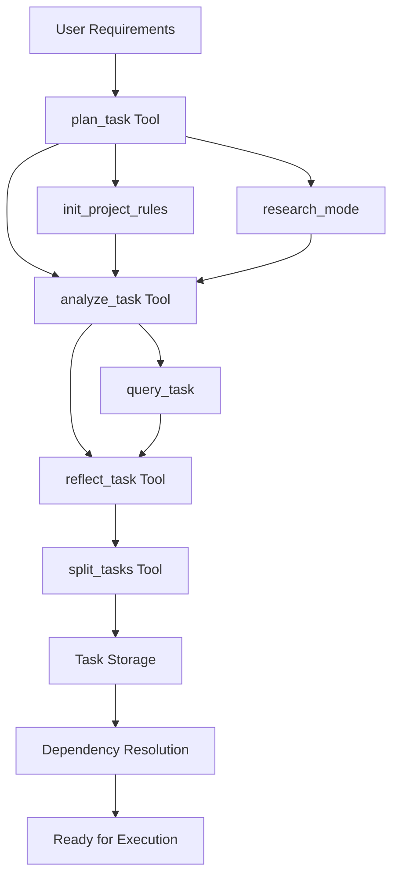
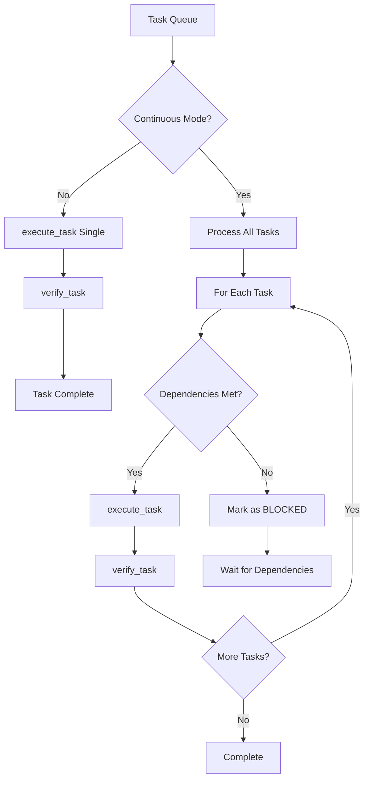
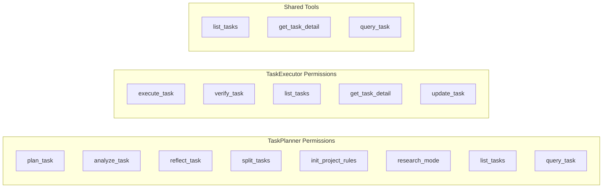
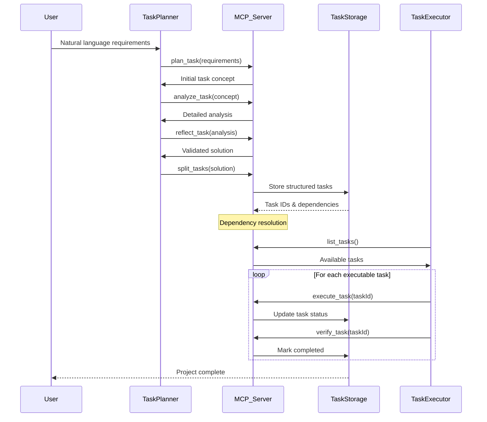
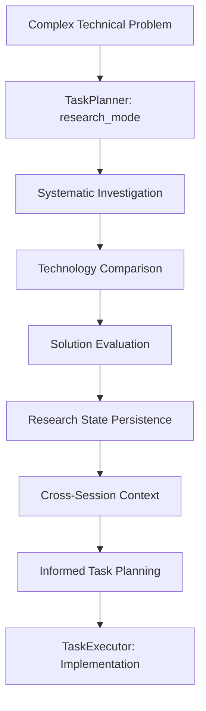
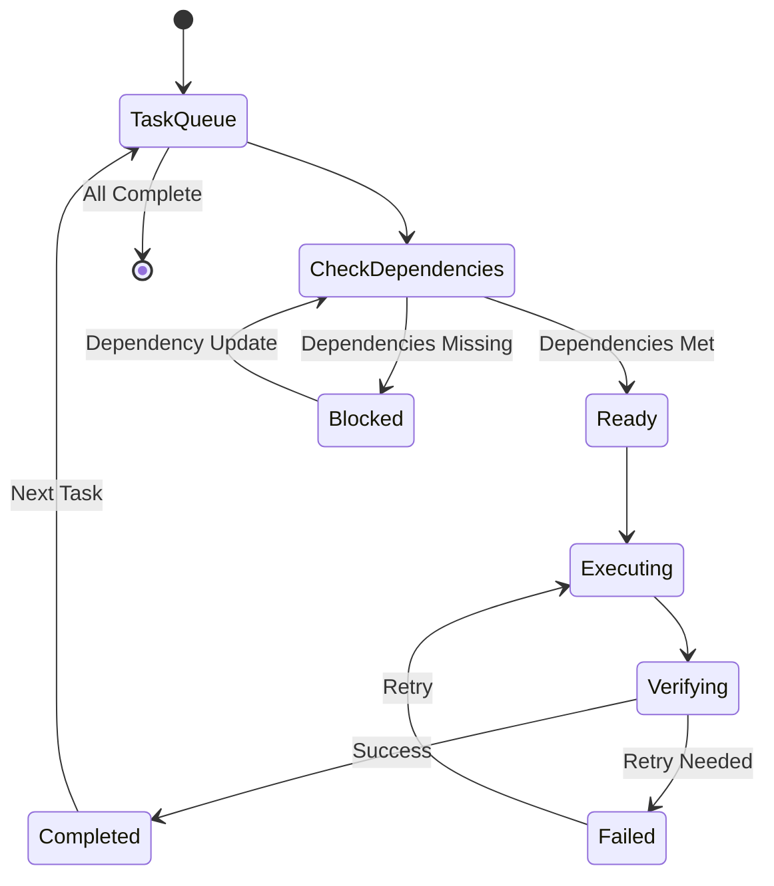
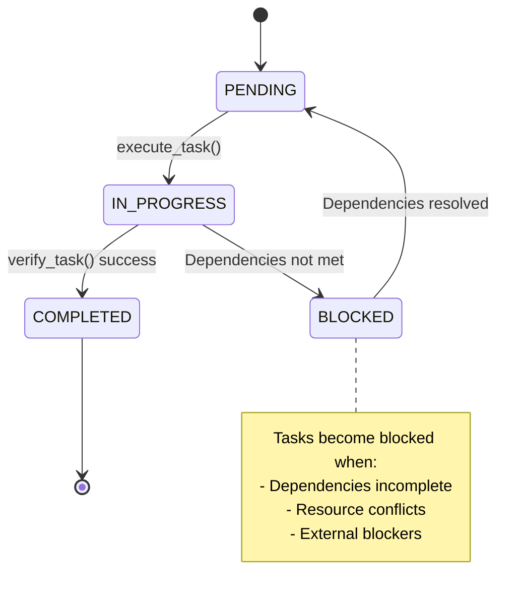

# MCP Shrimp Task Manager - Agent Coordination Documentation

**Repository**: https://github.com/cjo4m06/mcp-shrimp-task-manager  
**Documentation Date**: 2025-07-31  

## Agent Coordination Architecture

The MCP Shrimp Task Manager implements a sophisticated agent coordination system through **two distinct agent modes** with specific roles, permissions, and workflows.

## Agent Mode System

### TaskPlanner Mode
**Role**: Professional task planning expert  
**Primary Responsibility**: Convert natural language requirements into structured, executable tasks  
**Restrictions**: **STRICTLY PROHIBITED** from directly modifying program code or executing tasks  

#### TaskPlanner Capabilities
- **Requirements Analysis**: Understanding user needs and project context
- **Task Decomposition**: Breaking complex requirements into manageable subtasks
- **Dependency Management**: Defining task relationships and execution order
- **Project Standards**: Establishing and maintaining project rules and conventions
- **Research Coordination**: Systematic technical investigation and solution comparison

#### TaskPlanner Tool Access
```typescript
// Planning Tools
- plan_task         // Start task planning process
- analyze_task      // In-depth requirement analysis
- reflect_task      // Solution validation and optimization
- split_tasks       // Complex task decomposition

// Project Management
- init_project_rules // Define project standards
- research_mode     // Systematic technical research

// Task Information
- list_tasks        // Review existing tasks
- query_task        // Search task database
- get_task_detail   // Detailed task information
```

#### TaskPlanner Workflow


### TaskExecutor Mode  
**Role**: Professional task execution expert  
**Primary Responsibility**: Implement solutions and verify task completion  
**Operation Modes**: Single-task mode (default) or continuous mode  

#### TaskExecutor Capabilities
- **Task Implementation**: Execute specific tasks according to specifications
- **Solution Verification**: Validate task results against acceptance criteria
- **Continuous Processing**: Process entire task queue sequentially when requested
- **Dependency Awareness**: Execute tasks only when dependencies are satisfied

#### TaskExecutor Tool Access
```typescript
// Execution Tools
- execute_task      // Implement task solutions
- verify_task       // Validate task completion

// Task Management
- list_tasks        // Find unexecuted tasks
- get_task_detail   // Get implementation details
- update_task       // Update task content during execution
```

#### TaskExecutor Workflow


## Agent Coordination Mechanisms

### MCP Server as Central Hub
The `src/index.ts` MCP server orchestrates all agent interactions:

```typescript
// Tool Registration Pattern
const tools = [
  { name: 'plan_task', schema: planTaskSchema, handler: planTask },
  { name: 'execute_task', schema: executeTaskSchema, handler: executeTask },
  // ... 15 total tools
];

// Agent Request Handling
server.handle(CallToolRequestSchema, async (request) => {
  const { name, arguments: args } = request.params;
  const tool = tools.find(t => t.name === name);
  return await tool.handler(args);
});
```

### Permission and Capability Management
Permissions are enforced through **tool availability** rather than explicit access control:



### Task Memory and Context Sharing
**Automatic Backup System**: All task history is automatically backed up, providing long-term memory for agents:

```typescript
// Task Memory Function
- tasks.json           // Primary task storage
- tasks_backup_*.json  // Historical backups
- Context persistence  // Cross-session memory
```

**Benefits**:
- Avoid duplicate work
- Learn from past experiences  
- Maintain context across sessions
- Enable intelligent task suggestions

## Multi-Agent Coordination Workflows

### Complete Project Lifecycle


### Research Mode Coordination


### Continuous Execution Mode


## Agent State Management

### Task State Machine


### Data Persistence and Coordination
```typescript
// Task Storage Structure
interface Task {
  id: string;              // UUID v4
  name: string;            // Max 100 chars
  description: string;     // Min 10 chars
  status: TaskStatus;      // PENDING|IN_PROGRESS|COMPLETED|BLOCKED
  dependencies: TaskDependency[];
  relatedFiles: RelatedFile[];
  implementationGuide: string;
  verificationCriteria: string;
  createdAt: Date;
  updatedAt: Date;
}

// Coordination Data
interface TaskDependency {
  taskId: string;          // Reference to prerequisite task
}

interface RelatedFile {
  path: string;            // File path
  type: RelatedFileType;   // TO_MODIFY|REFERENCE|CREATE|DEPENDENCY|OTHER
  description: string;     // Purpose
  lineStart?: number;      // Code block start
  lineEnd?: number;        // Code block end
}
```

## Integration Patterns

### MCP Protocol Communication
```typescript
// Agent-to-Server Communication
const mcpTransport = new StdioServerTransport();

// Tool Call Pattern
const toolCall = {
  method: "tools/call",
  params: {
    name: "split_tasks",
    arguments: {
      updateMode: "selective",
      tasksRaw: JSON.stringify(tasks),
      globalAnalysisResult: "Project goals..."
    }
  }
};
```

### External System Integration
- **Cursor IDE**: Direct MCP client integration
- **Claude Desktop**: MCP protocol support
- **Web Browsers**: HTTP API + SSE for real-time updates
- **File System**: Direct file operations with path tracking

## Best Practices for Agent Coordination

### 1. Role Separation
- **TaskPlanner**: Never execute code directly
- **TaskExecutor**: Focus only on implementation
- **Clear boundaries**: Prevent role confusion

### 2. Dependency Management
- **Explicit dependencies**: Always specify task relationships
- **Validation**: Verify dependencies exist before task creation
- **Resolution**: Handle circular dependencies gracefully

### 3. Communication Patterns
- **Atomic operations**: Each tool call is self-contained
- **State persistence**: All changes persisted immediately
- **Error handling**: Graceful degradation on failures

### 4. Memory Management
- **Automatic backups**: Prevent data loss
- **Context retention**: Maintain long-term project memory  
- **Experience learning**: Improve efficiency over time

This agent coordination system enables sophisticated multi-agent workflows that can handle complex project management scenarios with proper role separation, dependency management, and state coordination.