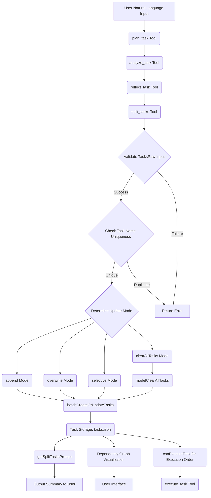
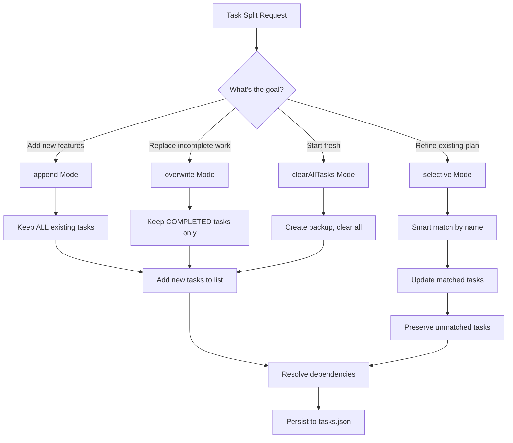
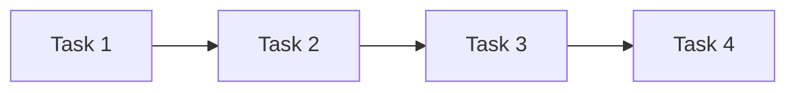
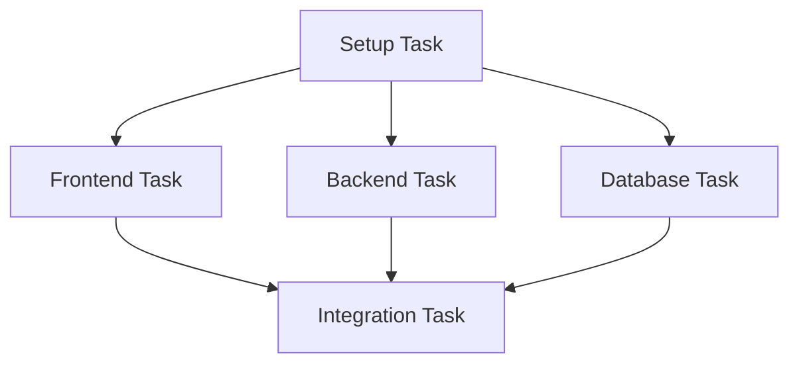
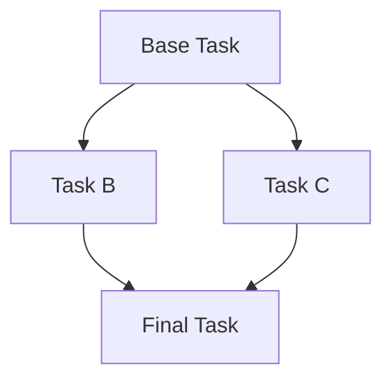
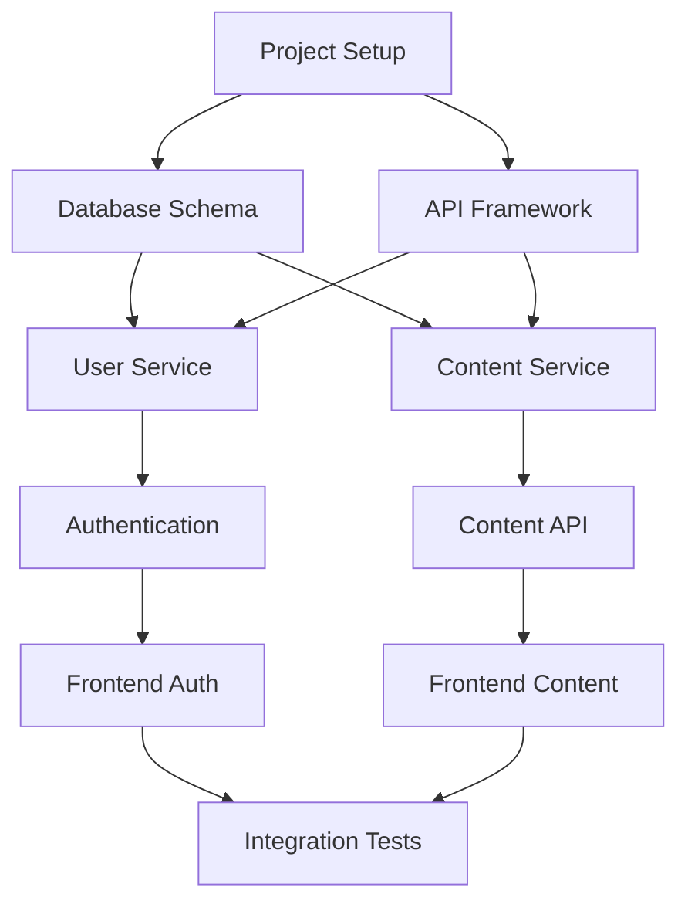

# MCP Shrimp Task Manager - Task Splitting & Dependencies System

**Repository**: https://github.com/cjo4m06/mcp-shrimp-task-manager  
**Documentation Date**: 2025-07-31  

## Task Splitting Architecture

The MCP Shrimp Task Manager implements a sophisticated task decomposition system through the `split_tasks` tool, enabling complex requirements to be broken down into manageable, interdependent subtasks with explicit dependency resolution.

## Core Task Splitting Workflow

### Complete Task Decomposition Pipeline


## Task Splitting Granularity Controls

### Granularity Rules and Constraints
The system enforces specific granularity controls to ensure optimal task sizing:

```typescript
// Granularity Controls
const GRANULARITY_CONTROLS = {
  // Minimum Viable Task: 1-2 working days (8-16 hours)
  minTaskDuration: 8,  // hours
  maxTaskDuration: 16, // hours
  
  // Maximum Complexity: Single technical domain
  maxComplexityDomains: 1, // frontend OR backend OR database (not multiple)
  
  // Recommended Task Limits
  maxSubtasksPerSplit: 10,    // Avoid more than 10 subtasks at once
  maxTasksRawLength: 5000,    // Character limit (reduced from 8000 in v1.0.10)
  
  // Task Tree Depth Limitation: ≤ 3 levels
  maxDepthLevels: 3,          // Functional Modules > Main Processes > Key Steps
  
  // Task Naming and Description
  maxTaskNameLength: 100,     // Characters
  minDescriptionLength: 10    // Characters
};
```

### Task Structure and Requirements
```typescript
interface TaskStructure {
  // Core Identification  
  name: string;              // Max 100 chars, clear purpose expression
  description: string;       // Min 10 chars, detailed implementation points
  
  // Implementation Details
  implementationGuide: string;    // Specific methods and pseudocode
  verificationCriteria: string;   // Validation standards and methods
  
  // Relationship Management
  dependencies: string[];         // Prerequisite task names/IDs
  notes?: string;                // Supplementary implementation suggestions
  
  // File Association
  relatedFiles: RelatedFile[];   // Associated files with line-level precision
}

interface RelatedFile {
  path: string;              // File path (relative or absolute)
  type: RelatedFileType;     // TO_MODIFY | REFERENCE | CREATE | DEPENDENCY | OTHER
  description: string;       // File purpose and content description
  lineStart?: number;        // Code block start line (optional)
  lineEnd?: number;          // Code block end line (optional)
}
```

## Dependency Resolution System

### Dependency Definition and Resolution
The system supports flexible dependency specification and resolution:

```typescript
// Dependency Specification Options
interface DependencyResolution {
  // Option 1: Task ID Reference (UUID v4)
  taskId: "a1b2c3d4-e5f6-7890-abcd-ef1234567890";
  
  // Option 2: Task Name Reference (more intuitive)
  taskName: "Setup Development Environment";
}

// Dependency Resolution Algorithm
class DependencyResolver {
  async resolveDependencies(dependencies: string[]): Promise<TaskDependency[]> {
    const resolved: TaskDependency[] = [];
    
    for (const dep of dependencies) {
      // 1. Try UUID interpretation first
      if (isUUID(dep)) {
        if (await taskExists(dep)) {
          resolved.push({ taskId: dep });
        }
      } 
      // 2. Try name-to-ID mapping
      else {
        const taskId = await taskNameToIdMap.get(dep);
        if (taskId && await taskExists(taskId)) {
          resolved.push({ taskId });
        }
      }
      // 3. Skip unresolvable dependencies with warning
    }
    
    return resolved;
  }
}
```

### Task Execution Order Resolution
```mermaid
graph TD
    A[Task Request] --> B{Check Dependencies}
    B --> C{All Dependencies COMPLETED?}
    C -->|Yes| D[Status: READY TO EXECUTE]
    C -->|No| E[Status: BLOCKED]
    
    E --> F{Monitor Dependency Changes}
    F --> G{Dependencies Now Complete?}
    G -->|Yes| H[Update Status: READY]
    G -->|No| I[Remain BLOCKED]
    
    D --> J[execute_task()]
    H --> J
    J --> K[Status: IN_PROGRESS]
    K --> L[verify_task()]
    L --> M[Status: COMPLETED]
    
    M --> N[Notify Dependent Tasks]
    N --> O[Re-evaluate Blocked Tasks]
```

## Update Modes and Task Management

### Four Update Modes
The `split_tasks` tool supports four distinct update modes for different scenarios:

```typescript
enum UpdateMode {
  // 1. Append Mode: Preserve all existing tasks, add new ones
  APPEND = "append",
  
  // 2. Overwrite Mode: Remove unfinished tasks, keep completed ones
  OVERWRITE = "overwrite", 
  
  // 3. Selective Mode: Smart update by name matching (recommended for refinements)
  SELECTIVE = "selective",
  
  // 4. Clear All Tasks Mode: Complete reset with backup (default)
  CLEAR_ALL_TASKS = "clearAllTasks"
}
```

#### Update Mode Decision Matrix


## Task Graph Management

### Dependency Graph Structure
```typescript
// Task Graph Representation
interface TaskGraph {
  nodes: TaskNode[];     // Individual tasks
  edges: TaskEdge[];     // Dependencies between tasks
}

interface TaskNode {
  id: string;           // Task UUID
  name: string;         // Task name
  status: TaskStatus;   // PENDING|IN_PROGRESS|COMPLETED|BLOCKED
  depth: number;        // Dependency depth level
}

interface TaskEdge {
  source: string;       // Prerequisite task ID
  target: string;       // Dependent task ID
  type: 'dependency';   // Edge type
}
```

### Dependency Graph Visualization
The system includes D3.js-based dependency graph visualization:

```typescript
// D3.js Dependency Graph Rendering
function renderDependencyGraph(tasks: Task[]) {
  // 1. Prepare nodes and links
  const nodes = tasks.map(task => ({
    id: task.id,
    name: task.name,
    status: task.status,
    group: getTaskGroup(task.status)
  }));
  
  const links = tasks.flatMap(task => 
    task.dependencies.map(dep => ({
      source: dep.taskId,
      target: task.id
    }))
  );
  
  // 2. Create D3.js force simulation
  const simulation = d3.forceSimulation(nodes)
    .force("link", d3.forceLink(links).id(d => d.id))
    .force("charge", d3.forceManyBody().strength(-300))
    .force("center", d3.forceCenter(width / 2, height / 2));
    
  // 3. Render with status-based coloring
  // ... D3.js rendering code
}
```

### Graph Integrity Management
```typescript
class TaskGraphManager {
  // Prevent deletion of tasks with dependents
  async canDeleteTask(taskId: string): Promise<boolean> {
    const dependentTasks = await findTasksWithDependency(taskId);
    return dependentTasks.length === 0;
  }
  
  // Detect circular dependencies
  detectCircularDependencies(tasks: Task[]): string[] {
    // Depth-first search implementation
    // Returns array of task IDs involved in cycles
  }
  
  // Calculate execution order
  calculateExecutionOrder(tasks: Task[]): Task[] {
    // Topological sort implementation
    // Returns tasks in dependency-resolved order
  }
}
```

## Task Splitting Examples and Patterns

### Example 1: Web Application Development
```json
{
  "updateMode": "clearAllTasks",
  "tasksRaw": "[
    {
      \"name\": \"Setup Development Environment\",
      \"description\": \"Initialize Next.js project with TypeScript and Tailwind CSS\",
      \"implementationGuide\": \"1. npx create-next-app@latest\\n2. Configure tsconfig.json\\n3. Install and configure Tailwind\",
      \"dependencies\": [],
      \"relatedFiles\": [
        {\"path\": \"package.json\", \"type\": \"CREATE\", \"description\": \"Project dependencies\"},
        {\"path\": \"tsconfig.json\", \"type\": \"CREATE\", \"description\": \"TypeScript configuration\"}
      ],
      \"verificationCriteria\": \"Project builds successfully with npm run build\"
    },
    {
      \"name\": \"Implement User Authentication\",
      \"description\": \"Create login/logout functionality with session management\",
      \"implementationGuide\": \"1. Setup Auth0 or NextAuth.js\\n2. Create login/logout pages\\n3. Implement session middleware\",
      \"dependencies\": [\"Setup Development Environment\"],
      \"relatedFiles\": [
        {\"path\": \"pages/api/auth/[...nextauth].ts\", \"type\": \"CREATE\", \"description\": \"NextAuth configuration\"},
        {\"path\": \"middleware.ts\", \"type\": \"CREATE\", \"description\": \"Auth middleware\"}
      ],
      \"verificationCriteria\": \"User can successfully login and logout with persistent sessions\"
    }
  ]",
  "globalAnalysisResult": "Build a secure, scalable web application with modern React practices"
}
```

### Example 2: API Development with Microservices
```json
{
  "updateMode": "selective",
  "tasksRaw": "[
    {
      \"name\": \"Design Database Schema\", 
      \"description\": \"Create PostgreSQL schema for user management and content storage\",
      \"implementationGuide\": \"1. Define user entity tables\\n2. Create content storage tables\\n3. Set up relationships and indexes\",
      \"dependencies\": [],
      \"relatedFiles\": [
        {\"path\": \"migrations/001_initial_schema.sql\", \"type\": \"CREATE\", \"description\": \"Database migration\"}
      ],
      \"verificationCriteria\": \"Schema passes normalization checks and supports required queries\"
    },
    {
      \"name\": \"Implement User Service API\",
      \"description\": \"RESTful API for user CRUD operations with authentication\",
      \"implementationGuide\": \"1. Create Express.js routes\\n2. Implement JWT auth middleware\\n3. Add input validation\",
      \"dependencies\": [\"Design Database Schema\"],
      \"relatedFiles\": [
        {\"path\": \"src/services/userService.ts\", \"type\": \"CREATE\", \"description\": \"User service implementation\"},
        {\"path\": \"src/routes/users.ts\", \"type\": \"CREATE\", \"description\": \"User API routes\"}
      ],
      \"verificationCriteria\": \"API passes all unit tests and integration tests with >90% coverage\"
    }
  ]"
}
```

## Advanced Dependency Patterns

### Sequential Dependencies


### Parallel Dependencies  


### Diamond Dependencies


### Complex Dependency Web


## Implementation Best Practices

### 1. Task Atomicity
- Each task should be completable independently
- Avoid tasks that span multiple technical domains
- Ensure clear completion criteria

### 2. Dependency Clarity
- Use descriptive task names for better readability
- Minimize dependency chains (prefer parallel execution)
- Document why dependencies exist

### 3. Granularity Balance
- Not too small: Avoid trivial tasks (< 2 hours work)
- Not too large: Avoid complex tasks (> 16 hours work)  
- Maintain logical coherence within each task

### 4. Verification Standards
- Each task must have clear acceptance criteria
- Include both functional and non-functional requirements
- Specify testing requirements and coverage expectations

### 5. File Association
- Link tasks to specific files they modify or create
- Use line-level precision for code modifications
- Categorize file relationships (modify/reference/create/dependency)

This task splitting and dependency system enables sophisticated project decomposition with proper dependency management, execution ordering, and visual representation - far beyond simple task lists or basic dependency tracking.