# MCP Shrimp Task Manager - Visual Documentation & Diagrams

**Repository**: https://github.com/cjo4m06/mcp-shrimp-task-manager  
**Documentation Date**: 2025-07-31  

## Complete System Architecture Diagrams

### High-Level System Architecture
Multi-layered architecture showing AI client integration with the MCP server and core application components:

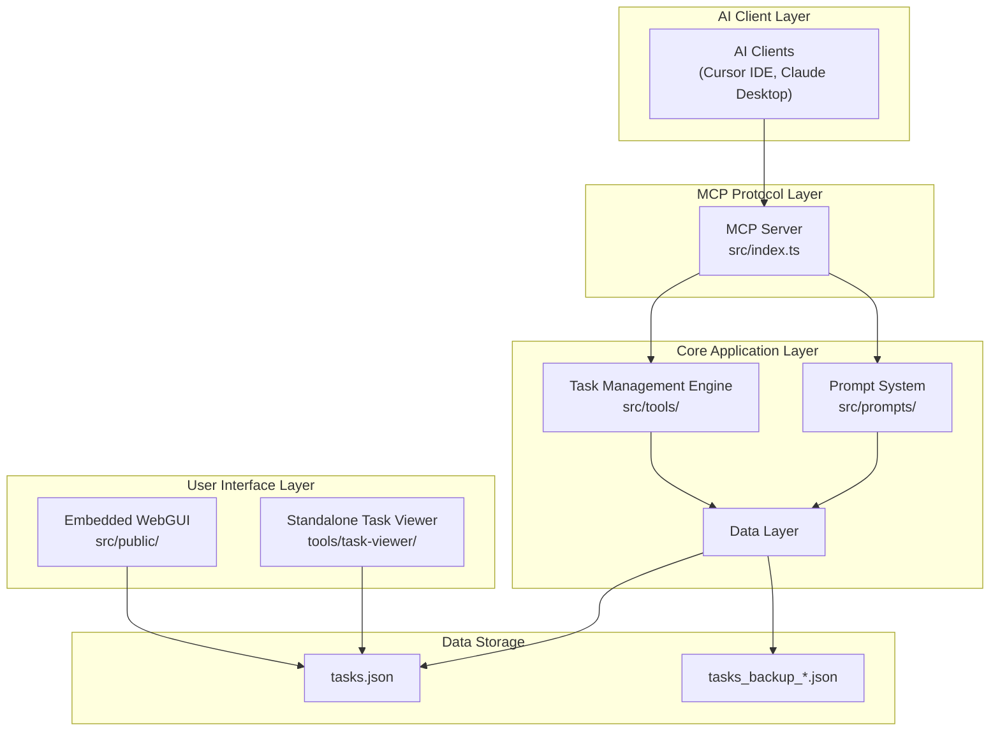

### Core MCP Server Integration
Detailed view of MCP SDK integration with task management tools:

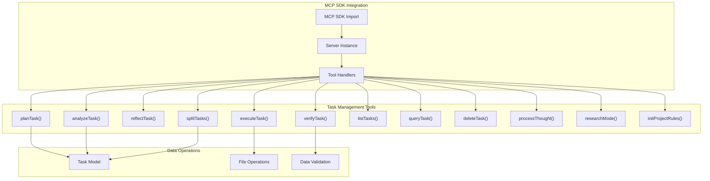

### Integration Points and Data Persistence
How external systems integrate with core data operations:

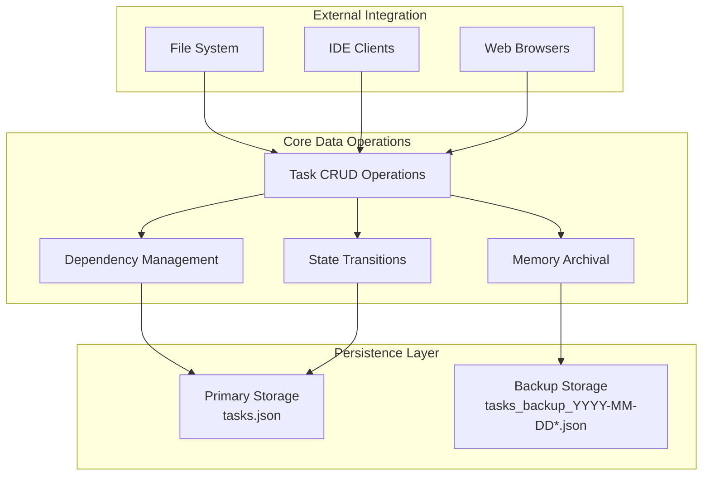

## Task Workflow and Lifecycle Diagrams

### Task Data Flow and State Management
Complete pipeline from natural language input to task execution:

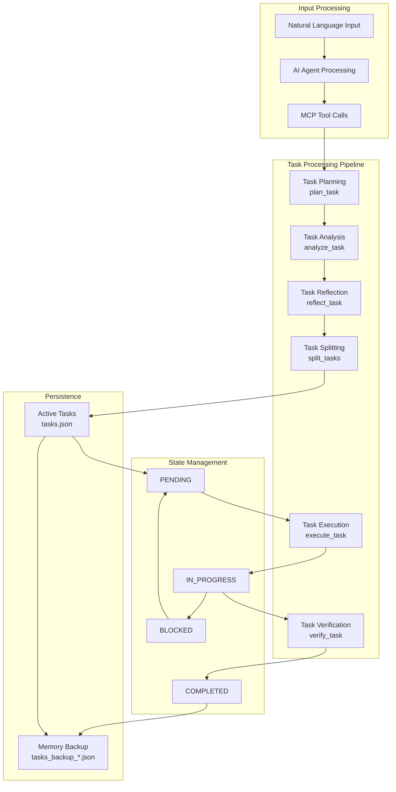

### Configuration and Template Processing Flow
How configuration and templates generate dynamic prompts:

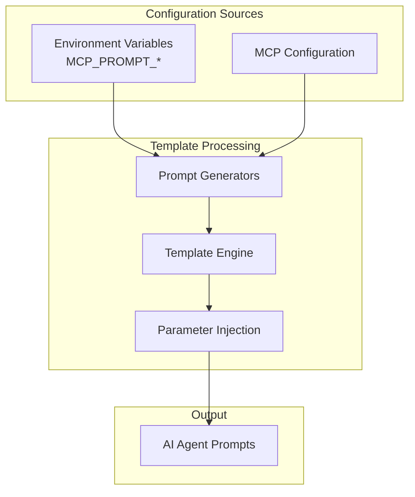

## Agent Coordination and Workflow Diagrams

### AI Agent Integration Layer
How TaskPlanner and TaskExecutor modes interact with core workflow tools:

```mermaid
graph TD
    subgraph "AI Agent Modes"
        taskPlanner["TaskPlanner Mode\nPlanning & Analysis Only"]
        taskExecutor["TaskExecutor Mode\nImplementation & Verification"]
    end
    
    subgraph "Planning Tools"
        planTask["plan_task\ngetPlanTaskPrompt()"]
        analyzeTask["analyze_task\ngetAnalyzeTaskPrompt()"]
        reflectTask["reflect_task\ngetReflectTaskPrompt()"]
        splitTasksRaw["split_tasks\nTask Decomposition"]
        initRules["init_project_rules\nProject Standards"]
        researchMode["research_mode\nSystematic Investigation"]
    end
    
    subgraph "Execution Tools"
        executeTask["execute_task\ngetExecuteTaskPrompt()"]
        verifyTask["verify_task\ngetVerifyTaskPrompt()"]
        updateTask["update_task\nContent Updates"]
    end
    
    subgraph "Shared Tools"
        listTasks["list_tasks\nTask Overview"]
        queryTask["query_task\nTask Search"]
        getDetail["get_task_detail\nDetailed Information"]
    end
    
    taskPlanner --> planTask
    taskPlanner --> analyzeTask
    taskPlanner --> reflectTask
    taskPlanner --> splitTasksRaw
    taskPlanner --> initRules
    taskPlanner --> researchMode
    
    taskExecutor --> executeTask
    taskExecutor --> verifyTask
    taskExecutor --> updateTask
    
    taskPlanner --> listTasks
    taskPlanner --> queryTask
    taskPlanner --> getDetail
    taskExecutor --> listTasks
    taskExecutor --> queryTask
    taskExecutor --> getDetail
```

### Multi-Agent Coordination Sequence
Complete project lifecycle with agent handoffs:

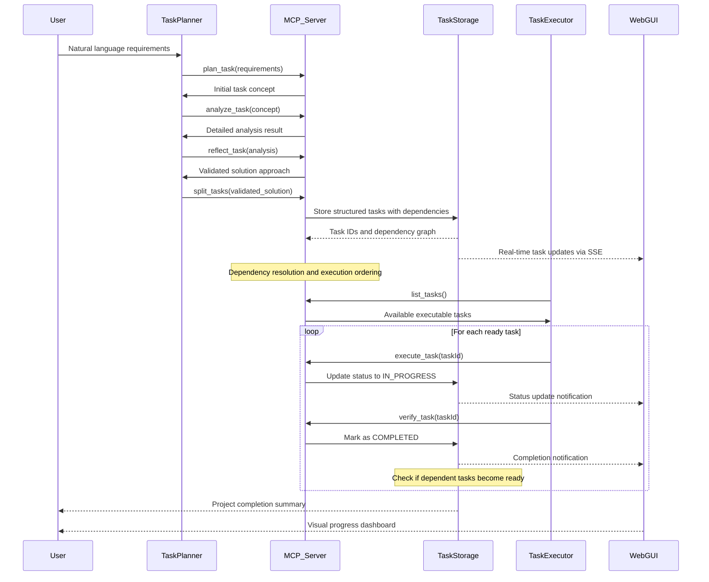

## Web Interface Architecture and Components

### Web Interface Component Architecture
Dual interface system with embedded and standalone components:

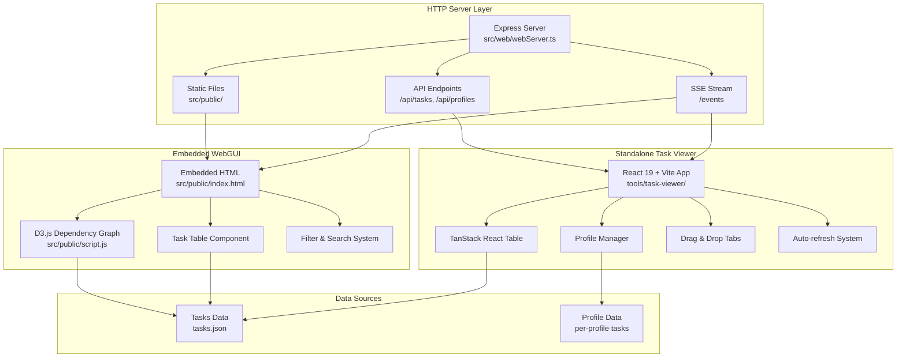

### Dependency Graph Visualization
D3.js-based interactive dependency graph with status-based coloring:

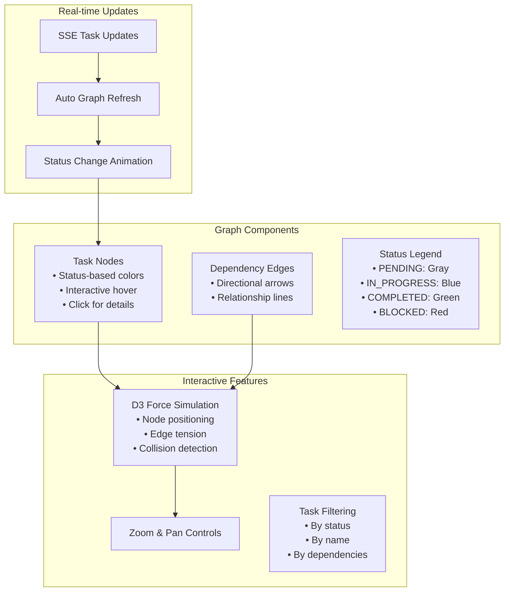

## Task State and Lifecycle Diagrams

### Task State Machine
Complete state transitions with conditions:

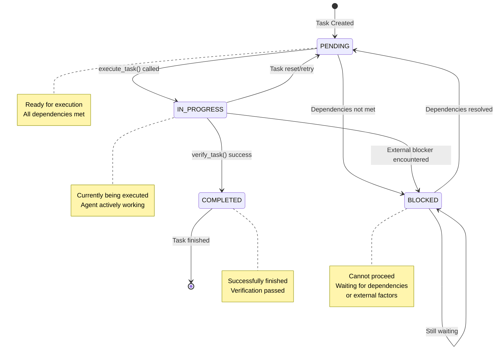

### Task Dependency Resolution Flow
How the system resolves and manages task dependencies:

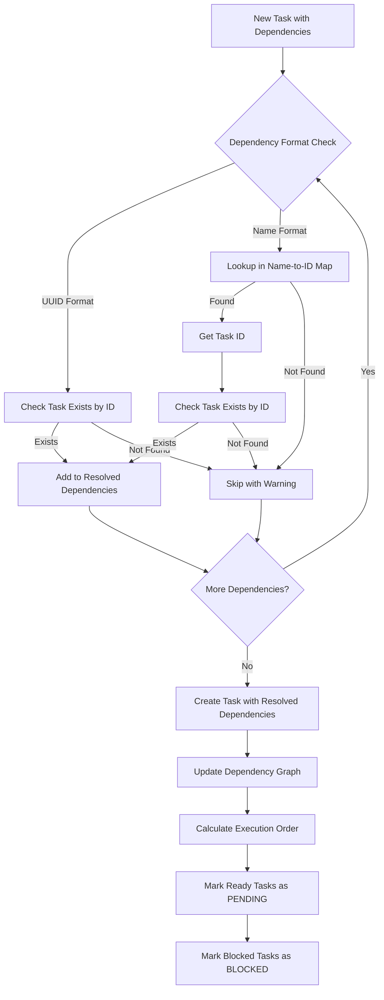

## System Integration Patterns

### MCP Protocol Communication Flow
How external clients communicate with the MCP server:

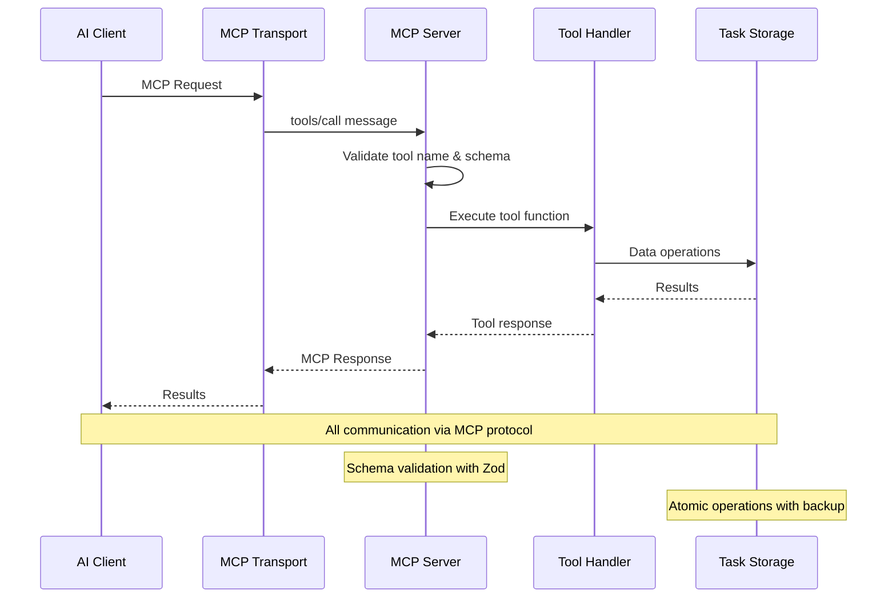

### Real-time Update Architecture
Server-Sent Events (SSE) for live updates:

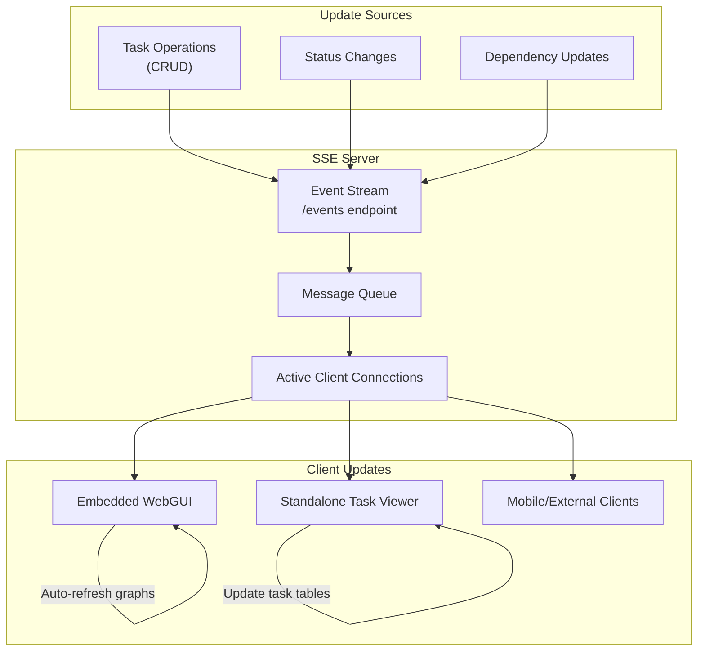

## Performance and Scalability Patterns

### Task Processing Optimization
How the system handles large task sets efficiently:

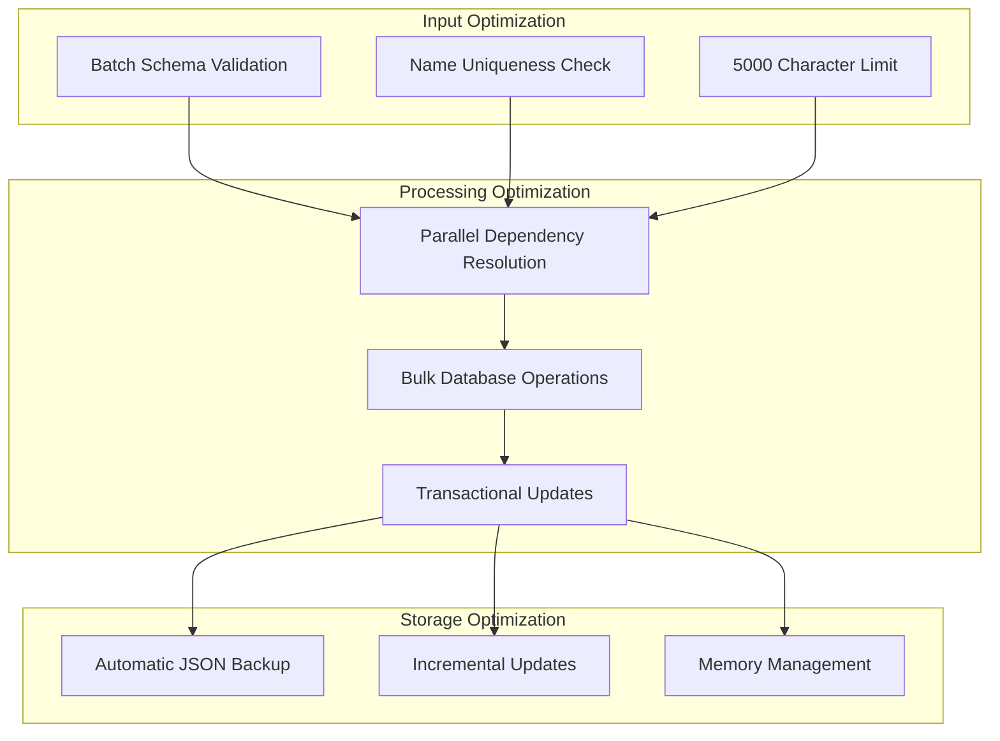

This comprehensive visual documentation provides complete system understanding through diagrams covering architecture, workflows, agent coordination, web interfaces, state management, and integration patterns - enabling full comprehension of the sophisticated task management system.